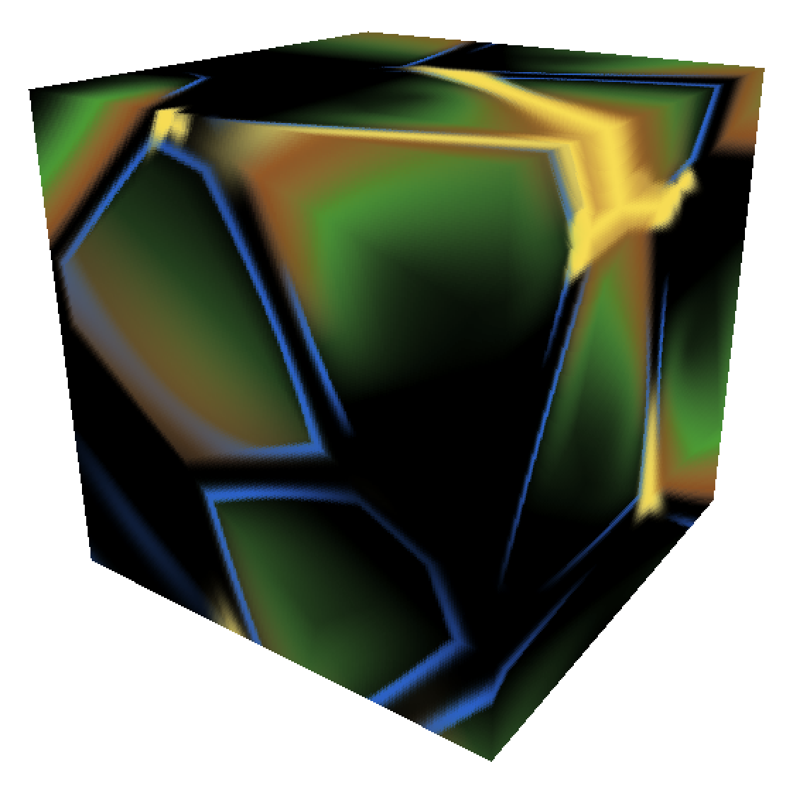
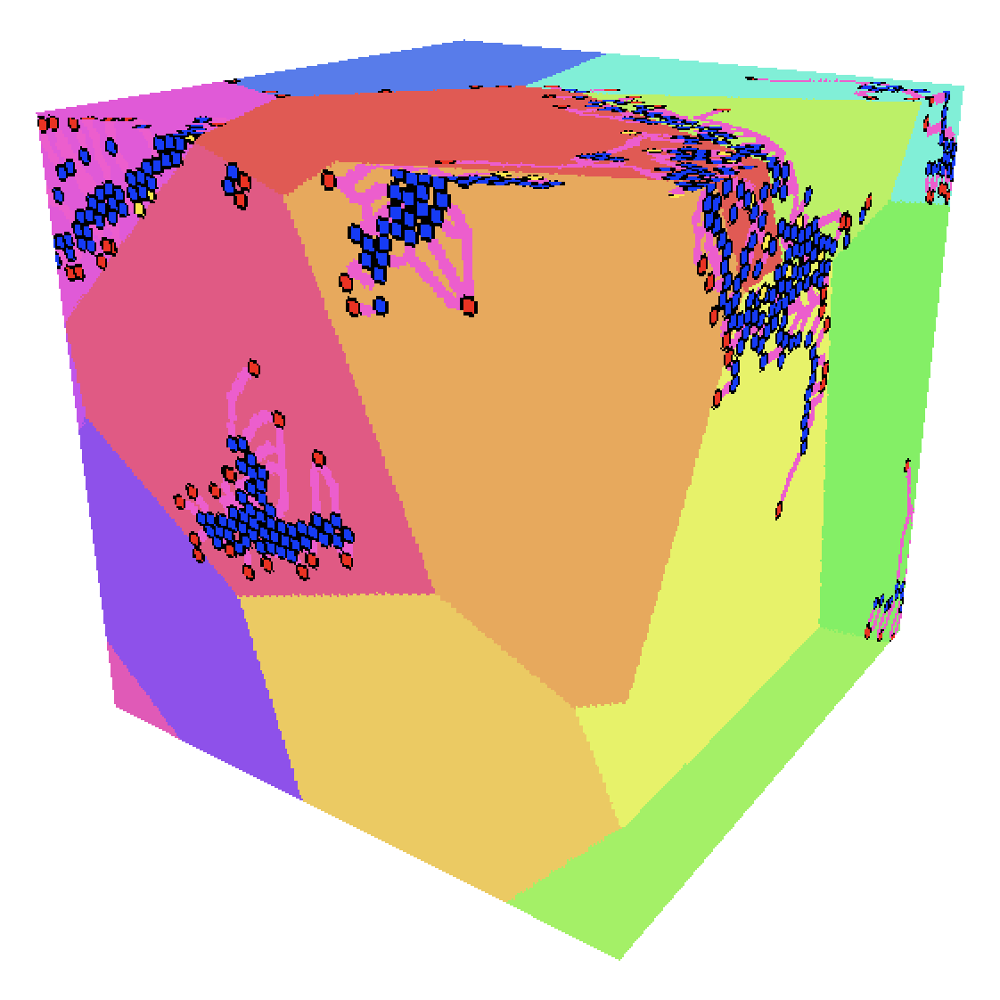
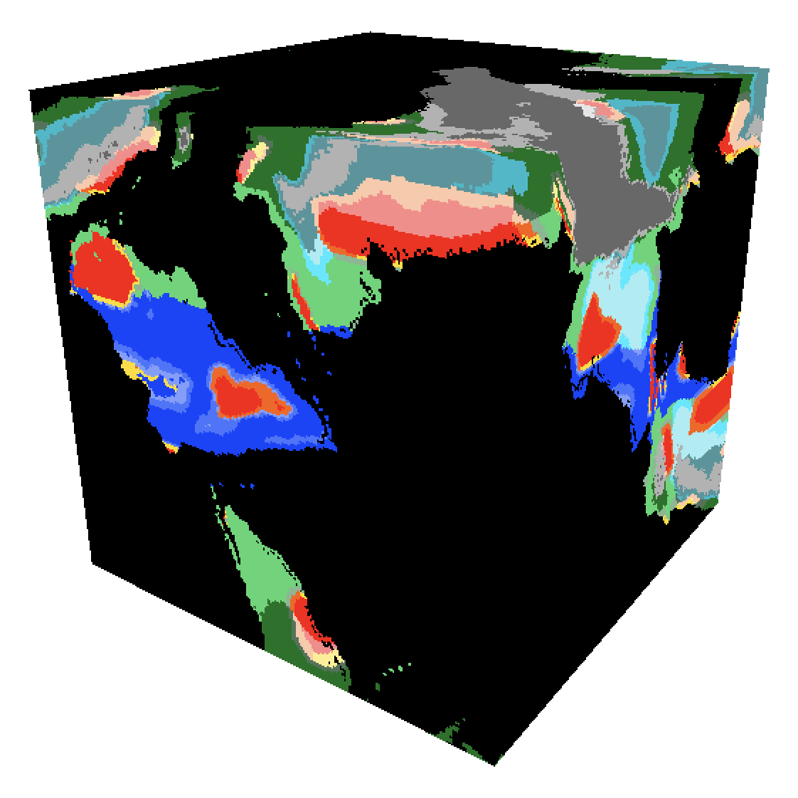

# Plate-Local River Generation

**Michael K. Davis III** — June 2026

A deterministic procedural world-generation system that produces coherent 
continents and terrain-aware, downhill-flowing river networks without 
precomputing an entire planet.

Each tectonic plate is defined by a deterministic seed position serving a 
dual purpose: continuous pointwise terrain evaluation through plate-derived 
fields, and a bounded geometric domain for plate-local river preprocessing. 
River networks are generated and cached lazily per plate, allowing 
independent regional processing without a planet-wide generation pass.

| (a) Plate-derived continent fields | (b) Plate-local river networks | (c) Final continental output |
|:---:|:---:|:---:|
|  |  |  |

**(a)** Plate-derived weight fields place land (green), mountains (brown), island chains (blue), and plateaus (yellow).
**(b)** Each river network is generated inside a straight-bordered geometric plate domain. Blue dots mark river sources, red dots mark sea-level outlets, yellow dots mark lakes at local minima, and pink lines mark river segments.
**(c)** Final landmasses include continental warping, surface roughness, and climate classification.

This system is developed for use in a voxel video game featuring 
cube-shaped planets as a deliberate design choice. The cube geometry 
informs how plate domains are constructed and how river networks are 
projected onto the planet surface.

## Documentation

The full technical summary is available in
[davis2026_plate_local_river_generation.pdf](davis2026_plate_local_river_generation.pdf).

## Status

Pre-alpha. Annotated source code will be added in a future release.
A companion YouTube video and further documentation are in preparation.

## License

This work is licensed under
[CC BY 4.0](https://creativecommons.org/licenses/by/4.0/).
