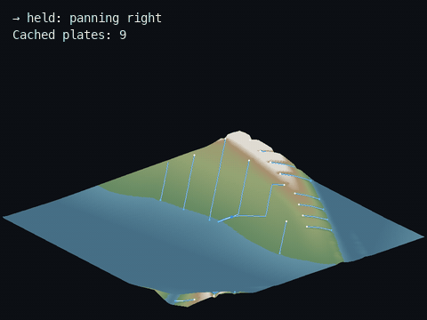
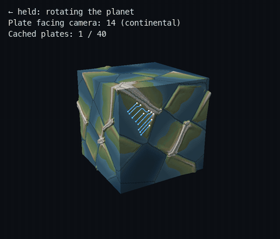
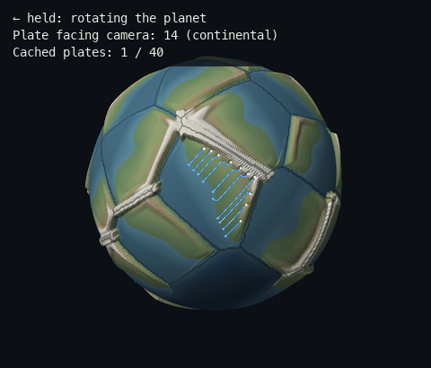

# Plate-Local River Generation

arXiv post: https://arxiv.org/pdf/2610.00301

Deterministic, terrain-aware, downhill-flowing river networks for procedural worlds, generated lazily one tectonic plate at a time. This repository contains three dependency-free C++17 toy examples of the Plate-Local River Generation Algorithm (PLRGA): a flat infinite world, a finite cube planet, and a finite sphere planet.

Tectonic plate seeds define both the continuous terrain fields and a bounded geometric domain for each plate. Rivers are traced downhill on a low-resolution grid inside that domain, cached per plate the first time the plate is needed, and blended into the full-resolution terrain on demand. Neither the terrain nor the rivers need a global preprocessing pass.

The accompanying paper is [`davis2026_plate_local_river_generation.pdf`](davis2026_plate_local_river_generation.pdf). The flat infinite example is the implementation behind the paper's results.

AI was used to refactor and add visuals to this repository.

## Examples:

The following animations were generated with the three toy examples. Each shows an arrow key held down while rivers are generated and cached for newly reached plates.

<table>
  <tr>
    <td rowspan="2">
      
    </td>
    <td>
      
    </td>
  </tr>
  <tr>
    <td>
      
    </td>
  </tr>
</table>

## Requirements

- CMake 3.16 or newer
- A C++17 compiler
- macOS, for the interactive viewers (Cocoa). On other platforms the examples still build and export images or heightmaps.
- zlib, only for the flat world's paper figure exporter

## How To Use

### Build and Run

Each example is a standalone CMake project. From the example's directory:

```sh
cmake -S . -B build -DCMAKE_BUILD_TYPE=Release
cmake --build build -j
ctest --test-dir build --output-on-failure
```

Then run its viewer:

```sh
# flat_infinite/
build/flat_infinite_cli

# cube_finite/
build/cube_finite

# sphere_finite/
build/sphere_finite
```

### Controls

| Example | Keys |
|---|---|
| Flat infinite | Arrow keys pan across the plane, left-drag rotates the view, Esc closes |
| Cube and sphere | Arrow keys rotate the planet, `P` toggles plate colouring, `R` toggles rivers, `+`/`-` zoom, Esc closes |

Run any executable with `--help` for its options, such as `--seed`, `--plates`, or `--resolution`. Without a window, `flat_infinite_cli --output terrain.pgm` exports a heightmap, and the planet examples accept `--snapshot FILE.ppm` to render a single frame.

### Configuration

All world, terrain, and river parameters are in `flat_infinite/include/flat_infinite/config.hpp` and `<cube|sphere>_finite/include/finite_world/config.hpp`. The two planet examples share identical code except for the surface selected in their `config.hpp`.

### Lazy Per-Plate River Caches

A plate's rivers are built the first time they are needed and then reused.

- In the flat world, caches are built for the 3×3 plates around the view as it moves.
- On the planets, only the plate facing the camera is built. Rotating back to a plate reuses its cache.

Each viewer shows how many plates are cached.

### Downhill Guarantee

The plate borders used for terrain are warped with noise, while rivers are planned inside straight-edged geometric plate domains. The border margin for rivers (`river_border_distance` or `river_border_margin`) is set larger than the maximum warp displacement, so every river channel lies on its own plate. The final terrain therefore never rises along a channel. If you increase the warp amplitude (`plate_stretching` or `warp_amplitude`), increase the margin to match. Each example's tests check this guarantee.

### Reproducing the Paper's Results

`flat_infinite/build/flat_infinite_export` regenerates the paper's Figure 1 and its metrics. See `flat_infinite/metrics/README.md` for the exact command and what each measurement means.

## Directory Architecture

```text
.
├── davis2026_plate_local_river_generation.pdf   # the accompanying paper
├── assets/                             # example animations used in this README
│
├── flat_infinite/                      # flat, infinite world (the paper's implementation)
│   ├── include/flat_infinite/
│   │   ├── config.hpp                  # all world, terrain, and river parameters
│   │   ├── world.hpp                   # World: plates, terrain, river caches, height queries
│   │   ├── geometry.hpp                # points, segments, polygons
│   │   ├── noise.hpp                   # hashing and value/Brownian noise
│   │   └── visualizer.hpp              # interactive viewer entry point
│   ├── src/
│   │   ├── terrain.cpp                 # plate seeds, pointwise fields, plate polygons and grids
│   │   ├── rivers.cpp                  # river tracing, height adjustment, caching, river fields
│   │   ├── geometry.cpp
│   │   ├── noise.cpp
│   │   ├── main.cpp                    # command-line tool: viewer or heightmap export
│   │   ├── visualizer_macos.mm         # native macOS viewer
│   │   └── visualizer_stub.cpp         # non-macOS placeholder
│   ├── tools/export_figure.cpp         # paper figure and metrics exporter
│   ├── metrics/                        # committed Figure 1, JSON summary, per-plate CSV
│   └── tests/test_flat_infinite.cpp
│
├── cube_finite/                        # finite cube planet
│   ├── include/finite_world/
│   │   ├── config.hpp                  # parameters, including the surface (cube)
│   │   ├── world.hpp                   # World: plates, terrain, charts, river caches
│   │   ├── render.hpp                  # planet mesh, camera, software renderer
│   │   ├── viewer.hpp                  # interactive viewer entry point
│   │   ├── math.hpp                    # Vec2/Vec3, Mat3 rotations, 2D segments
│   │   └── noise.hpp                   # 3D hashing and value/Brownian noise
│   ├── src/
│   │   ├── terrain.cpp                 # seeds, pointwise fields, plate charts and grids
│   │   ├── rivers.cpp                  # river tracing, height adjustment, caching, river fields
│   │   ├── render.cpp                  # perspective rasterizer with depth-tested rivers
│   │   ├── noise.cpp
│   │   ├── main.cpp                    # command-line tool: viewer or snapshot
│   │   ├── viewer_macos.mm             # native macOS viewer
│   │   └── viewer_stub.cpp             # non-macOS placeholder
│   └── tests/test_finite_world.cpp     # plate-domain and downhill-guarantee checks
│
└── sphere_finite/                      # finite sphere planet (same layout as cube_finite/)
```
